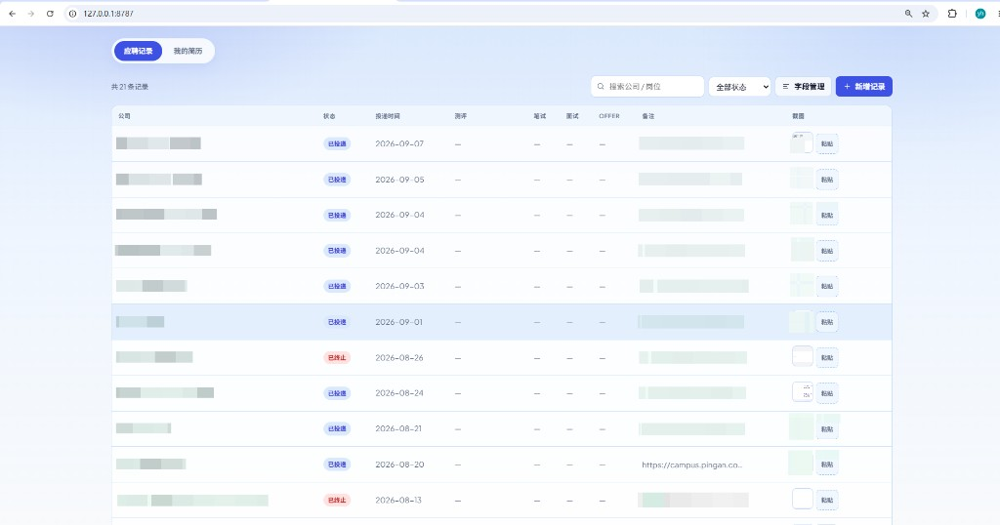
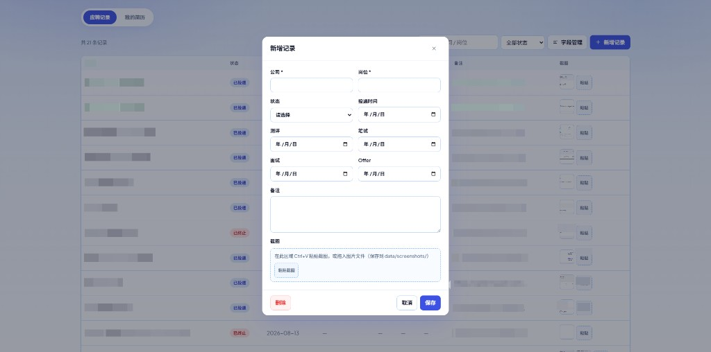
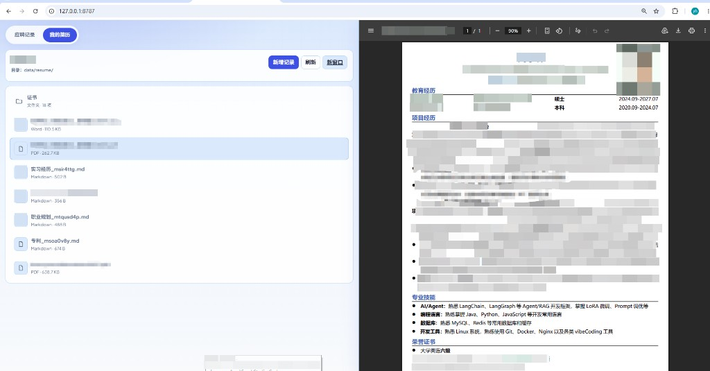

# 应聘记录（Application Record）

本地运行的个人应聘过程记录工具：零 npm 依赖、打开即用。  
用来记投递进度、粘贴截图、管理简历文件，数据全部落在项目目录里，方便自己备份。


---

## 界面预览

**应聘记录** — 投递列表、状态筛选、截图粘贴



**新增记录** — 填写投递信息，支持粘贴 / 拖入截图



**我的简历** — 左侧文件列表（支持文件夹），右侧预览



---

## 功能

### 应聘记录
- 新增 / 编辑 / 删除投递记录
- 按公司、岗位搜索，按状态筛选
- 默认字段：公司、岗位、状态、投递时间、测评、笔试、面试、Offer、备注、截图  
  （测评～Offer 为日期字段）
- **字段管理**：可增删字段，拖动手柄调整列表列顺序

### 截图
- 在列表或编辑弹窗中 `Ctrl+V` 粘贴，或拖入图片
- 文件保存在 `data/screenshots/`，记录里只存文件名

### 我的简历
- 顶部菜单切换进入
- 左侧文件列表，右侧半屏预览（顶到底）
- 支持文件夹浏览；可预览 PDF、Word（`.docx`）、图片、文本
- **新增记录**：右侧 Markdown 工作区，可切换编辑 / 预览  
  - 第一行是标题  
  - 虚线下方是正文  
  - 保存为 `data/resume/*.md`，并出现在左侧列表

### 网申资料助手
- 顶部切换到「网申资料」，按网申常见字段填写（姓名、身份证、教育、项目、家庭成员等）
- 资料保存在 `data/profile.json`，与 Chrome 扩展共用
- 打开招聘网站后点击扩展图标，再点输入框，从候选中填入（可撤销）
- 日期字段只作备忘，不自动填入；插件不会提交表单

双击 `start.bat` 时会用 Chrome/Edge 打开页面，并尝试用 `--load-extension` 加载 `extension/`。  
Chrome **不允许**程序完全静默安装扩展：若浏览器已经在运行，参数会被忽略，请在「网申资料」页按提示加载一次（开发者模式 → 加载已解压的扩展程序）。加载成功后会保留。

---

## 环境要求

- [Node.js](https://nodejs.org/) **18 或以上**
- **不需要**执行 `npm install`（无第三方依赖）

---

## 快速开始

### 1. 获取项目

```bash
git clone https://github.com/GGZZ99/application-record.git
cd application-record
```

或在 GitHub 页面 Download ZIP 后解压。

### 2. 启动

双击项目根目录的 [`start.bat`](start.bat)，会自动启动服务并用 Chrome/Edge 打开。

首次启动会生成：
- `data/store.json`（投递记录，来自 [`data/store.example.json`](data/store.example.json)）
- `data/profile.json`（网申资料，来自 [`data/profile.example.json`](data/profile.example.json)）

个人数据文件已加入 `.gitignore`，不会被提交。

---

## 使用说明

| 操作 | 说明 |
|------|------|
| 新增记录 | 「应聘记录」页点击「新增记录」 |
| 编辑记录 | 点击列表中的一行 |
| 字段管理 | 添加 / 删除字段；拖动左侧手柄排序 |
| 粘贴截图 | 聚焦截图区域后 `Ctrl+V`，或拖入图片 |
| 管理简历 | 顶部切换到「我的简历」；把 PDF / Word / 图片放进 `data/resume/` 后点刷新 |
| 写 Markdown 笔记 | 「我的简历」→「新增记录」→ 编辑 / 预览 → 保存 |
| 填写网申资料 | 顶部切换到「网申资料」，补全模板字段 |
| 网页填表 | 招聘页点击扩展图标启用，再点输入框选择候选 |

---

## 数据存哪里

全部在本地 `data/` 目录，可用 U 盘或 Git（私有仓库）自行备份。

| 路径 | 内容 |
|------|------|
| `data/store.json` | 字段定义 + 投递记录（**个人数据，不提交**） |
| `data/store.example.json` | 空模板（随仓库发布） |
| `data/profile.json` | 网申填写资料（**个人数据，不提交**） |
| `data/profile.example.json` | 网申字段模板（随仓库发布） |
| `data/screenshots/` | 截图文件 |
| `data/resume/` | 简历原件、Markdown 笔记 |

---

## 项目结构

```
application-record/
├── start.bat                 # Windows 一键启动（尝试加载 Chrome 扩展）
├── scripts/
│   └── open-browser.bat      # 用 Chrome/Edge 打开并 --load-extension
├── server.mjs                # 零依赖本地服务（静态页 + 读写 API）
├── extension/                # 网申填写 Chrome 扩展（开发者模式加载）
├── public/                   # 前端页面
│   ├── index.html
│   ├── app.js
│   ├── profile.js
│   ├── styles.css
│   └── favicon.svg
├── docs/                     # README 截图
│   ├── screenshot-records.png
│   ├── screenshot-add-record.png
│   └── screenshot-resume.png
├── data/
│   ├── store.example.json    # 投递记录模板
│   ├── profile.example.json  # 网申资料模板
│   ├── screenshots/          # 截图（运行时生成）
│   └── resume/               # 简历与笔记（自行放入 / 在线新建）
├── .gitignore
└── README.md
```

---

## 常见问题

**为什么不能直接双击打开 `index.html`？**  
浏览器禁止网页直接写入本地磁盘。本工具需要保存 JSON、截图和笔记，因此用一个极简 Node 服务提供读写能力。

**其他人 clone 后会看到我的投递记录吗？**  
不会。`data/store.json`、`data/profile.json`、截图和简历目录已在 `.gitignore` 中忽略；仓库里只有空的示例模板。

**start.bat 之后扩展没出现？**  
Chrome 不允许静默安装。请到「网申资料」页复制 `extension` 目录路径，在 `chrome://extensions` 打开开发者模式后「加载已解压的扩展程序」。若启动时 Chrome 尚未运行，`--load-extension` 可在当次会话生效。

**Markdown / Word 预览打不开？**  
预览依赖 CDN 脚本（marked / mammoth），首次使用需要能访问外网。PDF 与图片预览不依赖外网。

**如何备份？**  
复制整个 `data/` 文件夹即可；或把项目放到私有 Git 仓库并自行调整 `.gitignore` 以纳入个人数据。

---

## 开源协议

本项目采用 [MIT License](LICENSE)。

简单来说：

- 可以自由使用、修改、分发，也可用于商业用途
- 使用或再发布时，请保留原作者的版权声明与许可证文本
- 软件按「现状」提供，作者不对使用后果承担责任

完整条款见仓库根目录 [`LICENSE`](LICENSE) 文件。
